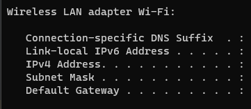

TO RUN:
1) Run the server side (enter the ipv4 configuration to the server)
2) GoTo class: KtorRealTimeMessagingClient
3) change the code url("ws://0.0.0.0:8081/play") //ipconfig To your ip
4) 
5) you want this Ipv4 when running ipconfig in your cmd
6) run 2 android devices with this program (or 2 emulators) (the updated program with your servers ip address) 
7) they will connect to the server and the game will run from there
8) when a game is finished wait a few seconds and it will restart